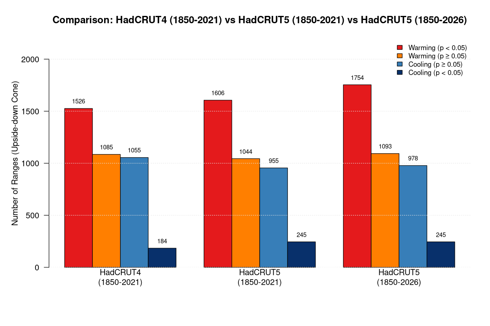
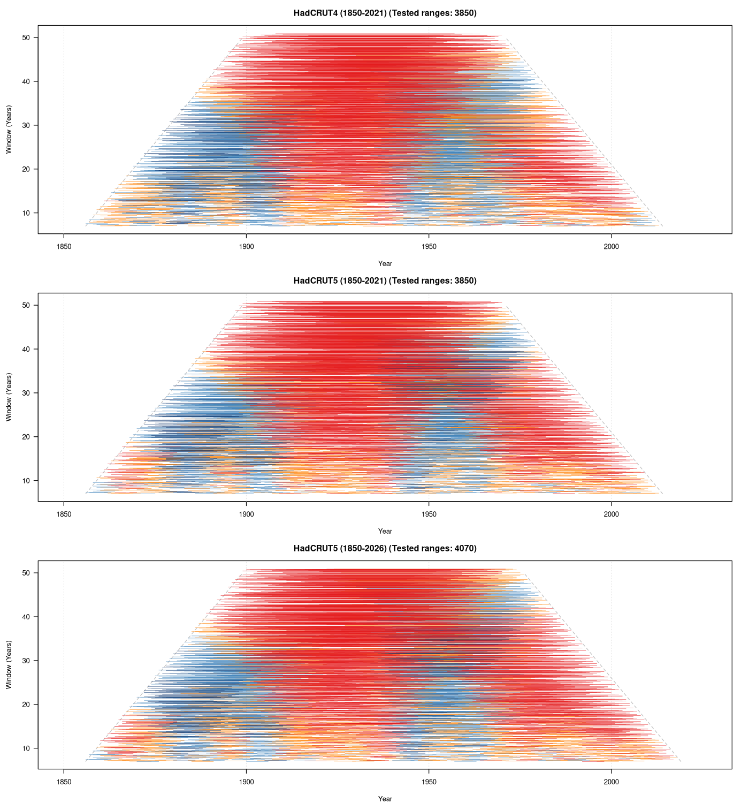

# HadCRUT Temperature Regression Analysis

This program analyzes linear temperature trends across continuous year ranges (7 to 50 years) from the UK Met Office HadCRUT datasets (HadCRUT4 and HadCRUT5).

By testing all continuous year ranges within an **upside-down cone** geometry, the analysis demonstrates how temperature trends behave across different time horizons, highlighting multi-decadal oscillations and long-term warming.

---

## 3-Way Comparative Overview

The analysis compares three configurations across window sizes of 7–50 years:
1. **HadCRUT4 (1850–2021)**: Retired baseline dataset (172 years).
2. **HadCRUT5 (1850–2021)**: Modern dataset over the identical historical period for direct baseline comparison.
3. **HadCRUT5 (1850–2026)**: Full contemporary series (177 years).

### Summary Statistics (Upside-Down Cone)

| Category | HadCRUT4 (1850–2021) | HadCRUT5 (1850–2021) | HadCRUT5 (1850–2026) |
|---|---|---|---|
| **Total Ranges in Cone** | 3,850 | 3,850 | 4,070 |
| **Statistically Sig. Warming ($p < 0.05$)** | 1,526 (39.6%) | 1,606 (41.7%) | 1,754 (43.1%) |
| **Non-Sig. Warming ($p \ge 0.05$)** | 1,085 (28.2%) | 1,044 (27.1%) | 1,093 (26.9%) |
| **Non-Sig. Cooling ($p \ge 0.05$)** | 1,055 (27.4%) | 955 (24.8%) | 978 (24.0%) |
| **Statistically Sig. Cooling ($p < 0.05$)** | 184 (4.8%) | 245 (6.4%) | 245 (6.0%) |

---

## Distribution Comparison



---

## How the Upside-Down Cone Works

When evaluating temperature trends over sliding windows of varying duration $L$ ($7 \le L \le 50$ years), boundary conditions can distort statistical comparisons if longer windows are allowed to abut the extreme edges of the historical record arbitrarily.

The **upside-down cone** geometry enforces symmetric boundary tapering as window length increases:

```
Window Length (L)
  50 yrs |         /=========================\         (Narrow span: 1899 to 1976)
         |        /                           \
  30 yrs |       /                             \
         |      /                               \
   7 yrs |     /=================================\     (Wide span: 1856 to 2019)
         +---------------------------------------------
              1850                                  2026  (Year)
```

### Mathematical Formulation
For a time series with $N$ annual measurements spanning years $Y_{\text{first}}$ to $Y_{\text{last}}$:
- **Starting Index:** $i_{\text{start}} = L$, so the earliest window starts at year $Y_{\text{start}} = Y_{\text{first}} + L - 1$.
- **Ending Index:** $i_{\text{end}} = N - 2L$, so the latest window ends at year $Y_{\text{end}} = Y_{\text{last}} - L$.
- **Symmetric Inward Slopes:** Both the left and right boundaries slope inward at $45^\circ$ (1 year of boundary buffer per 1 year of increased window duration).

### Key Benefits
1. **Edge Effect Elimination:** Prevents long multi-decade windows from disproportionately anchoring to sparse early historical measurements (1850s) or recent unclosed decades.
2. **Symmetric Temporal Centering:** Ensures that tested intervals at every window length $L$ remain balanced around the historical midpoint of the observational record.
3. **Oscillation Clarity:** Separates short-term internal climate variability (e.g. ~20–30 year cycles such as PDO/AMO) from secular multi-decadal warming trends without boundary distortion.

---

## Upside-Down Cone Regression Charts

In the interval charts below, each horizontal segment represents a linear regression over a specific time window:
- **Vertical Axis:** Window length (7 to 50 years).
- **Horizontal Axis:** Year.
- **Dashed Lines:** Outer boundaries of the upside-down cone.
- **Colors:**
  - **Red:** Statistically significant warming ($p < 0.05$)
  - **Orange:** Non-significant warming ($p \ge 0.05$)
  - **Cyan:** Non-significant cooling ($p \ge 0.05$)
  - **Blue:** Statistically significant cooling ($p < 0.05$)

Statistically most significant ranges are plotted on top.



---

## How to Run

The script is implemented in standard R without external library dependencies:

```bash
Rscript HadCRUT-analysis.R
```

Outputs generated:
- `chart-hadcrut4.png` / `barchart-hadcrut4.png`
- `chart-hadcrut5-2021.png` / `barchart-hadcrut5-2021.png`
- `chart-hadcrut5-2026.png` / `barchart-hadcrut5-2026.png`
- `chart-comparison.png` / `barchart-comparison.png`

---

## Data Source
- UK Met Office Hadley Centre HadCRUT4 / HadCRUT5 Open Data.

