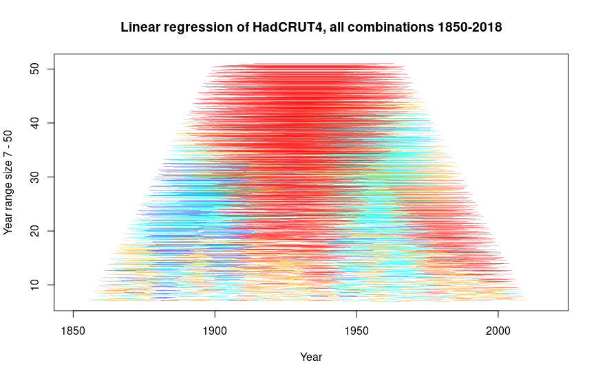

# HadCRUT analysis

This program analyzes temperature data from HadCRUT data set.

It is easy to say that temperature is rising or dropping if you can select
the years what you compare. This program shows *all* the meaningful year
ranges that are available in the measurements.

Meaningful data ranges are considered all those, who are 7 - 50 years.
The whole data set is 168 years.

In the data set there are currently years 1850 - 2018. At those
years there are about 1400 year ranges between seven and fifty
years that show statistically meaningful increase in temperatures.
Additionally there are about 1000 year ranges that show increase in
the temperature but it is not statistically important. There are
also about 1000 year ranges that show non-statistically-important
cooling. But there are still about 200 year ranges that show
statistically important cooling.

When we put the ranges to the chart, we get a better view of
oscillation of warming and cooling periods. The chart hides
outliers nicely.

Range lines are randomly spread between the range-length-year and
the next range-length-year to avoid them totally shadowing each other.
Statistically most significant range is on the top.

In the bottom we see that there is oscillation of little over 20 years
between cooling and warming periods. In the middle there seems
to be larger oscillation of about 60 years but we really see only
two cooling periods that does not make it possible to make
any conclusions. Of the periods over 40 years we do not
have enough measurements to say anything meaningful. If there
is oscillation of 60 years, we would not see it in the top of the
chart yet.

Program loads data set directly from UK Met Office.
It is implemented with R statistical language and it does not
need any extra libraries.
